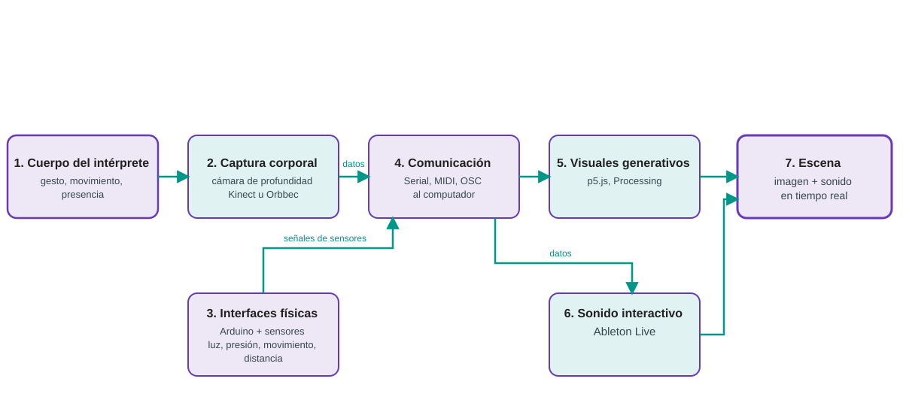
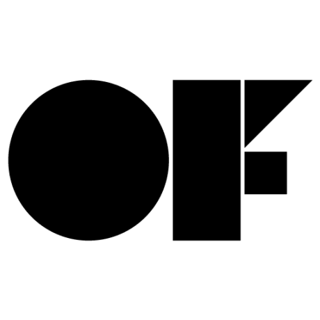
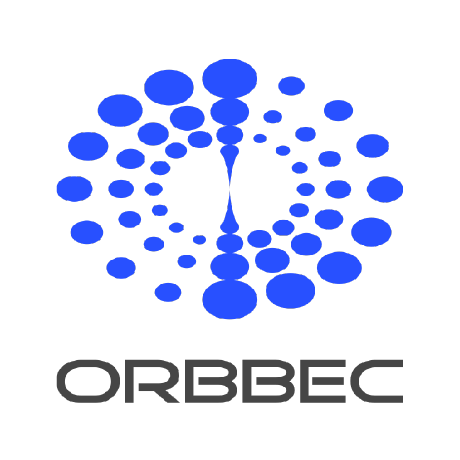

# 1. Presentación del sistema

## 1.1. Proyecto «Cuerpo, sensor y escena»

«Cuerpo, sensor y escena» es un proyecto de integración entre **artes escénicas, música y tecnología interactiva**. Su propósito es construir un sistema en el que el cuerpo del intérprete —sus gestos, su movimiento y su presencia en el espacio— se convierta en datos que generan **imagen y sonido en tiempo real**.

El proyecto funciona como un laboratorio transversal en el que confluyen tres asignaturas:

- **Posproducción de Medios Audiovisuales**: relación entre interacción, imagen, montaje, sincronización y sonido.
- **Innovación con Nuevos Medios**: código, sensores, arquitectura del sistema y experimentación tecnológica.
- **Danza y Nuevas Tecnologías**: gesto, espacio, dramaturgia corporal y respuesta del sistema interactivo.

## 1.2. Objetivo de la implementación

El objetivo técnico es entregar un sistema **funcional, documentado y reproducible** que permita:

1. Capturar el movimiento corporal con una cámara de profundidad.
2. Leer señales de sensores físicos mediante Arduino.
3. Comunicar esos datos al computador por Serial, MIDI u OSC.
4. Transformar los datos en visuales generativos.
5. Controlar parámetros sonoros en Ableton Live.
6. Integrar todo en prototipos cuerpo–imagen–sonido listos para aula, ensayo y escena.

El sistema debe poder montarse, calibrarse y operarse siguiendo esta documentación, sin depender del conocimiento interno de una sola persona.

## 1.3. Alcance del ingeniero electrónico

El ingeniero electrónico es responsable de:

- La **arquitectura** general del sistema (hardware y software).
- La **selección, conexión y alimentación** de los dispositivos.
- La **programación** de Arduino y de las rutinas de captura y comunicación.
- El **desarrollo de los visuales generativos** y los mapeos con Ableton Live.
- La **documentación técnica** (este sitio) y la **entrega** de código, diagramas, presets y ejemplos.
- El **apoyo técnico** al equipo docente en ejercicios y prototipos.

El **diseño pedagógico** —contenidos, actividades, rúbricas y seguimiento— está a cargo del equipo docente.

## 1.4. Componentes generales del sistema

El sistema se compone de cuatro bloques que se detallan en la sección [2. Arquitectura general](02-arquitectura.md):

| Bloque | Componentes | Función |
| --- | --- | --- |
| Captura corporal | Kinect u Orbbec | Convertir el cuerpo en datos de articulaciones y posición. |
| Interfaces físicas | Arduino + sensores | Leer luz, presión, movimiento o distancia. |
| Visuales generativos | openFrameworks, p5.js o Processing | Generar imagen a partir de los datos. |
| Sonido interactivo | Ableton Live | Generar y controlar sonido a partir de los datos. |

**Esquema general del sistema**

<figure markdown>

<figcaption>Figura 1. Esquema general del sistema. Detalle técnico en [2. Arquitectura general](02-arquitectura.md).</figcaption>
</figure>

**Tecnologías utilizadas**

[{ width="120" }](https://www.arduino.cc/)
[{ width="140" }](https://www.ableton.com/)
[{ width="120" }](https://processing.org/)
[{ width="120" }](https://p5js.org/)
[{ width="100" }](https://openframeworks.cc/)
[{ width="100" }](https://www.orbbec.com/)
[{ width="90" }](https://midi.org/)

No se muestra logotipo de Kinect porque es un producto descontinuado; en su lugar, la captura corporal se apoya en cámaras de profundidad actuales como Orbbec, que mantienen el mismo flujo de datos.

!!! info "Marcas y logotipos"
    Los logotipos y marcas pertenecen a sus respectivos propietarios y se utilizan aquí únicamente para identificar las tecnologías del sistema.

## 1.5. Público beneficiario y contextos de uso

**Público**: estudiantes y docentes de artes escénicas y musicales, con o sin experiencia previa en programación o electrónica.

**Contextos de uso**:

- **Aula / laboratorio**: espacio de aprendizaje y prototipado guiado.
- **Ensayo**: espacio de exploración y ajuste de la interacción.
- **Escena**: presentación pública del prototipo en condiciones reales.

## 1.6. Glosario técnico

Los términos técnicos usados en esta documentación están definidos en el [Glosario técnico](glosario.md).

## 1.7. Organización del repositorio

El repositorio [github.com/joseurgilesc/Cuerpo-sensor-y-escena](https://github.com/joseurgilesc/Cuerpo-sensor-y-escena) organiza el proyecto de la siguiente manera:

<!-- TODO: confirmar y completar la estructura real de carpetas cuando existan los archivos de código -->

```
Cuerpo-sensor-y-escena/
├── docs/                  # Documentación técnica (MkDocs, este sitio)
├── mkdocs.yml             # Configuración del sitio
├── arduino/               # Firmware de las interfaces físicas
├── openframeworks/        # Aplicaciones de visuales generativos
├── p5js/                  # Visuales generativos en el navegador
├── ableton/               # Presets, racks y proyectos de Ableton Live
├── diagramas/             # Diagramas de conexión y arquitectura
├── presets/               # Presets reutilizables
├── ejemplos/              # Ejemplos cuerpo–imagen, sensor–sonido, etc.
└── .github/workflows/     # Publicación del sitio en GitHub Pages
```

## 1.8. Código, ejemplos y presets disponibles

El repositorio incluye, en la medida en que avanza el cronograma:

- **Código base de Arduino** para leer sensores y enviar datos.
- **Aplicaciones de visual** en openFrameworks y p5.js.
- **Proyectos y racks de Ableton Live** para mapeo de gestos y sensores.
- **Presets** de mapeo reutilizables.
- **Ejemplos integrados** (cuerpo–imagen, sensor–sonido, cuerpo–imagen–sonido).

!!! note "Pendiente de datos del ingeniero"
    La lista exacta de archivos, sus nombres y las versiones se completa en la sección [12. Entrega y transferencia](12-entrega.md) conforme se desarrollan los prototipos.

## Correspondencia con el cronograma

La implementación técnica avanza en tres momentos:

| Mes | Alcance |
| --- | --- |
| **Octubre** | Arquitectura general, preparación del entorno, integración de Kinect u Orbbec, inicio de Arduino y sensores, primeras pruebas de conexión. |
| **Noviembre** | Finalización de Arduino y sensores, protocolos de comunicación, visuales generativos, integración con Ableton Live, presets y ejemplos cuerpo–imagen–sonido, pruebas en aula y laboratorio. |
| **Diciembre** | Integración de prototipos, pruebas finales, documentación de operación y mantenimiento, entrega de código y transferencia técnica. |
