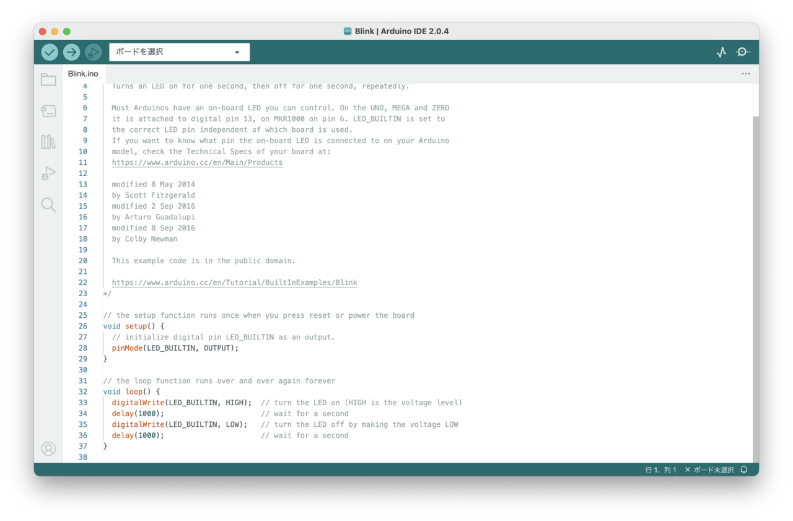
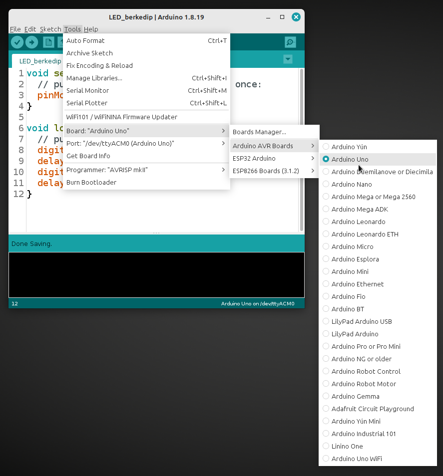
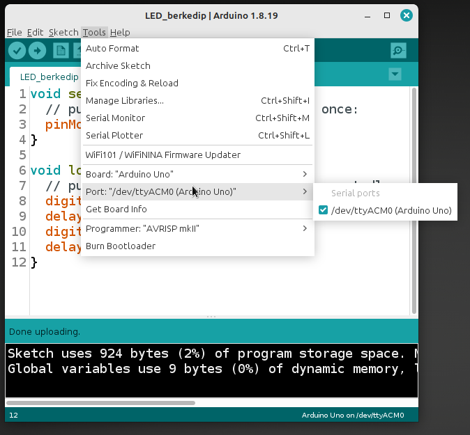

# 3. Preparación del entorno

## 3.1. Inventario de equipos y componentes

Antes de instalar, verifica que dispones de todo el hardware:

| Elemento | Cantidad | Observaciones |
| --- | --- | --- |
| Cámara web | 1 | Integrada en el computador o USB |
| Arduino (placa) | 1 | <!-- TODO: indicar modelo --> |
| Makey Makey | 1 | Con caimanes y cable USB |
| Sensores (luz, presión, distancia) | <!-- TODO --> | Según la actividad |
| Pulsadores y controles físicos | <!-- TODO --> | Según la actividad |
| Cables USB y de prototipado | <!-- TODO --> | Incluye jumpers |
| Computador | 1 | Ver requisitos en [2.7](02-arquitectura.md#27-requisitos-minimos-del-sistema) |
| Proyector o pantalla | 1 | Salida visual |
| Sistema de audio / interfaz | 1 | Salida sonora |

## 3.2. Versiones de software utilizadas

<!-- TODO: fijar las versiones exactas con las que se probó el sistema -->

| Software | Versión | Nota |
| --- | --- | --- |
| Arduino IDE | <!-- TODO --> | Para cargar el firmware |
| p5.js | <!-- TODO --> | Visuales en navegador |
| Tone.js | <!-- TODO --> | Motor de sonido (Web Audio) |
| ml5.js | <!-- TODO --> | Detección de pose en el navegador |

!!! warning "Consistencia de versiones"
    Usar siempre la misma versión de cada software durante todo el proyecto. Cambiar de versión a mitad del proceso suele romper la comunicación y dificulta reproducir los resultados.

## 3.3. Cámara web y ml5.js

La captura usa la **cámara web** del computador, que no requiere controladores adicionales:

1. Verifica que la cámara web del computador funciona.
2. Incluye la biblioteca **ml5.js** en el sketch (CDN o descarga local).
3. Autoriza el uso de la cámara cuando el navegador lo solicite.

<!-- TODO: enlazar la versión exacta de ml5.js -->

La configuración completa se documenta en la sección [4. Captura corporal](04-captura-corporal.md).

## 3.4. Configuración de Arduino IDE

Arduino IDE es el entorno donde se escribe, compila y carga el firmware en la placa. Esta sección cubre la instalación, la selección de placa y puerto, y la primera carga de verificación.

### 3.4.1. Descarga e instalación

1. Descarga la versión estable de [Arduino IDE](https://www.arduino.cc/en/software) para tu sistema operativo (Windows 10/11 o macOS).
2. Ejecuta el instalador y acepta la instalación de los **controladores** (drivers) que propone: son necesarios para que el computador reconozca la placa.
3. Abre Arduino IDE. La ventana principal muestra un **sketch** (programa) vacío, listo para editar:

<figure markdown>
{ width="700" }
<figcaption>Figura 2. Arduino IDE 2.x con el ejemplo Blink abierto.</figcaption>
</figure>

### 3.4.2. Conexión de la placa

1. Conecta la placa Arduino al computador por **USB**.
2. Comprueba que el **LED de alimentación** de la placa se enciende.
3. La primera vez, el sistema operativo puede tardar unos segundos en instalar el controlador automáticamente.

### 3.4.3. Selección de la placa

1. Si tu modelo no aparece por defecto, instálalo desde **Herramientas → Placa → Gestor de placas**.
2. En **Herramientas → Placa**, selecciona el **modelo exacto** de tu placa (por ejemplo, *Arduino Uno*):

<figure markdown>
{ width="380" }
<figcaption>Figura 3. Selección de placa: Herramientas → Placa → Arduino Uno.</figcaption>
</figure>

### 3.4.4. Selección del puerto

1. Ve a **Herramientas → Puerto** y selecciona el puerto de la placa (en Windows suele llamarse `COM3`, `COM4`, etc.):

<figure markdown>
{ width="380" }
<figcaption>Figura 4. Selección de puerto: Herramientas → Puerto.</figcaption>
</figure>

2. Si el puerto no aparece, desconecta y reconecta la placa, y revisa que el controlador esté instalado.

### 3.4.5. Primera carga (verificación)

1. Abre un ejemplo simple: **Archivo → Ejemplos → 01.Basics → Blink**.
2. Haz clic en **Verificar** (✓) para compilar; debe terminar sin errores.
3. Haz clic en **Subir** (→) para cargar el sketch en la placa.
4. Observa el **LED integrado** (normalmente en el pin 13) parpadeando: confirma que placa, puerto y firmware funcionan.

### 3.4.6. Librerías adicionales

<!-- TODO: indicar librerías adicionales que instalar desde el gestor de librerías -->

Cuando el firmware necesite componentes específicos (sensores, pantallas, etc.), instala las librerías desde **Herramientas → Administrar bibliotecas** (gestor de librerías). Las librerías concretas de cada interfaz se documentan en la sección [5. Arduino e interfaces físicas](05-arduino.md).

!!! note "Créditos de las imágenes"
    Las capturas de pantalla del Arduino IDE provienen de [Wikimedia Commons](https://commons.wikimedia.org/) y se usan bajo licencia [CC BY-SA 4.0](https://creativecommons.org/licenses/by-sa/4.0/deed.es): *Arduino ide v2 blink screenshot* por 松浦知也; *Select Board Arduino Uno* y *Select port arduino uno* por Edwiyanto.

## 3.5. Configuración de p5.js

1. Usa el editor web o un servidor local con el archivo `index.html` base.
2. Incluye la biblioteca `p5.js` y, si se requiere, la de OSC (`p5.osc` u osc.js).
3. Verifica que un sketch básico dibuja en pantalla.

## 3.6. Configuración de Tone.js

1. Incluye Tone.js en el sketch (CDN o descarga local).
2. Inicia el contexto de audio con la primera interacción del usuario (ver [8.12](08-sonido.md#812-configuracion-de-latencia-y-audio)).
3. Crea las fuentes de sonido (sintetizadores o samples) y los efectos que usarás.
4. Crea un sketch base con las pistas preparadas para mapear.

## 3.7. Configuración de puertos y dispositivos

1. Conecta la cámara y el Arduino en **puertos USB distintos** (evita hubs sobrecargados).
2. Anota el **nombre del puerto** que asigna el sistema a cada dispositivo.
3. Define **puertos OSC** fijos para cada ruta (por ejemplo, cámara→visuales en un puerto).

<!-- TODO: definir el esquema de puertos OSC por defecto -->

## 3.8. Prueba inicial del sistema

Una vez instalado todo, realiza una prueba de humo:

1. Enciende el computador y abre Arduino IDE → comprueba que la placa responde.
2. Abre la aplicación de captura → comprueba que la cámara entrega frames.
3. Abre un sketch visual → comprueba que se dibuja.
4. Abre el sketch (p5.js + Tone.js) → comprueba que emite sonido.
5. Envía un valor de prueba por OSC → comprueba que llega al destino.

## 3.9. Lista de verificación de la instalación

- [ ] Cámara web funcionando y autorizada en el navegador.
- [ ] Arduino IDE configurado (placa y puerto correctos).
- [ ] p5.js funcionando.
- [ ] Tone.js emitiendo sonido.
- [ ] Puertos USB y OSC definidos y anotados.
- [ ] Prueba inicial completada sin errores.
